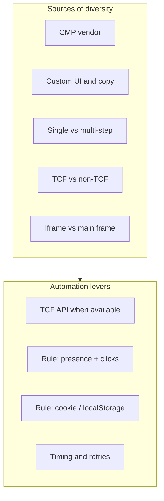

# 03 — Technical hurdles

**Last updated:** 2025-02 (initial)

## Table of contents

- [Lack of a single standard](#lack-of-a-single-standard)
- [Dark patterns and multi-step flows](#dark-patterns-and-multi-step-flows)
- [TCF coverage and API limitations](#tcf-coverage-and-api-limitations)
- [Iframes and timing](#iframes-and-timing)
- [Consent storage](#consent-storage)
- [Legal and ethical considerations](#legal-and-ethical-considerations)
- [Summary diagram](#summary-diagram)

---

## Lack of a single standard

There is no universal DOM or API for "Reject all" or "Necessary only." Implementations vary by CMP and by site customization.

- **Implication**: We need both an API-based path (TCF) and a DOM-based path (rules). Rules must be keyed by domain (or pattern) and describe selectors and optional storage, not assume a single layout.

---

## Dark patterns and multi-step flows

A large share of consent UIs use patterns that make rejection harder:

- Reject / "Necessary only" behind a "Preferences" or "Customize" link.
- Multiple steps: open preferences → disable categories → save.
- Asymmetric prominence: one large "Accept all" vs. a small or secondary reject option.

**Implication**: Rules must support **multi-step flows** (e.g. a sequence of clicks: first "Preferences", then "Necessary only" or "Reject all", then "Save"). Single-button rules are a subset.

---

## TCF coverage and API limitations

- Not all sites use TCF; many use custom or other CMPs.
- Even TCF CMPs may not support **setting** consent via the API (e.g. `postCustomConsent` is optional). Some only expose read and event APIs.
- When the API is read-only, we must fall back to UI automation (rules).

**Implication**: Detection order: try TCF first; if present and settable, use it; otherwise match domain to rules and execute rule-based flow.

---

## Iframes and timing

- Banners may be injected in **iframes** (cross-origin), where content scripts may have limited or no access.
- Scripts and banners load **asynchronously**; the CMP may appear after our script runs.

**Implication**: We need a strategy for (1) detecting when the CMP is ready (e.g. polling for `__tcfapi`, or waiting for a rule’s presence selector), and (2) handling iframe-hosted banners (e.g. main-frame only for v1, or documented limitation).

---

## Consent storage

Consent state is stored in cookies and/or localStorage with CMP-specific keys and values.

- **Implication**: Rules may need to describe not only clicks but also **cookie or localStorage writes** to set the correct "necessary only" state when the CMP expects it (e.g. Mozilla-style rules with cookie lists). This must stay declarative (name/value/host/path, no arbitrary code).

---

## Legal and ethical considerations

- Some interpretations of "consent" require a **user gesture** (e.g. a click). Automating the choice could be argued to be a different kind of "expression of intent" (the user opted into the extension to express minimal consent).
- **Our stance**: We document that the user, by installing and enabling Smooth-Cookie, has expressed the intent to choose minimal consent; we automate that expression. We do not provide legal advice; operators and users should consider their jurisdiction.

**Implication**: Design docs and README should state this clearly so the project’s intent is transparent.

---

## Summary diagram

Sources of diversity and the "attack surface" for automation:

All hurdles above are addressed in the [solution design](04-solution-design.md) and [rule format](05-rule-format-and-lifecycle.md).
