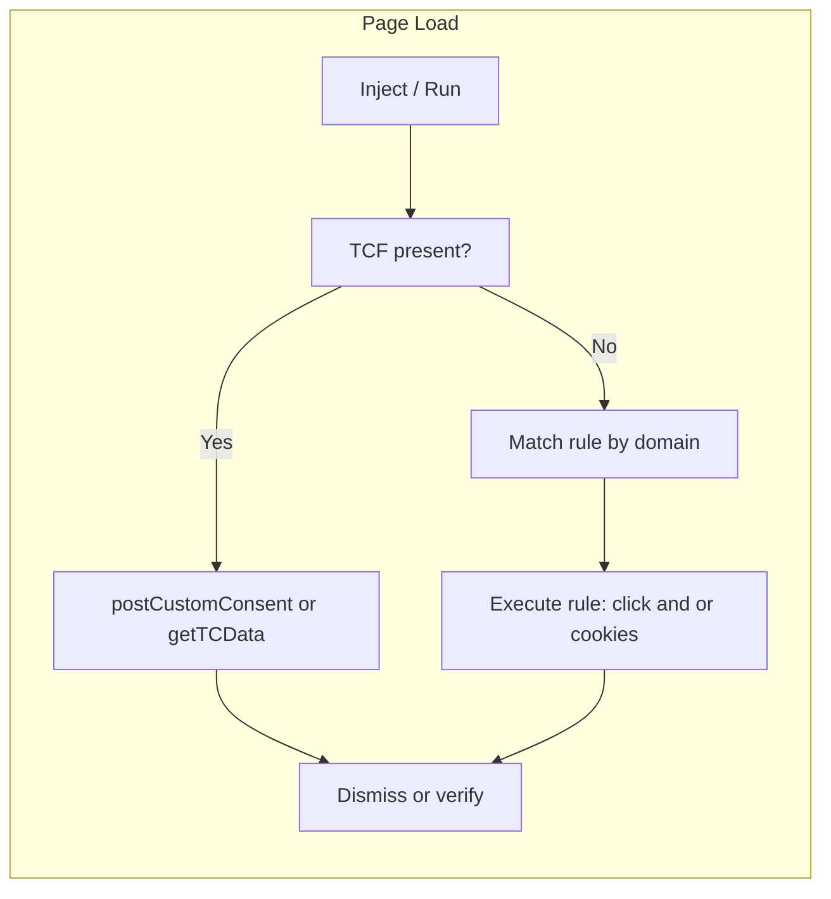

# 04 — Solution design

**Last updated:** 2025-02 (initial)

## Table of contents

- [Dual strategy](#dual-strategy)
- [Delivery](#delivery)
- [Rule format (overview)](#rule-format-overview)
- [Detection and execution order](#detection-and-execution-order)
- [High-level architecture](#high-level-architecture)

---

## Dual strategy

We combine two complementary approaches.

### 1. TCF-first

When the page exposes `__tcfapi`:

1. Call `ping` (or equivalent) to confirm the CMP is ready.
2. If the CMP supports **setting** consent (e.g. `postCustomConsent` or equivalent), call it with minimal purposes and no optional vendors to express "necessary only."
3. If successful, no DOM interaction is needed; optionally listen for consent update events to confirm or dismiss any visible banner.

When TCF is present but read-only, we do not attempt to set consent via the API; we fall back to rules.

### 2. Rule-based fallback

When TCF is absent or does not allow setting consent:

1. Match the current domain (or hostname) against the rule set (see [05-rule-format-and-lifecycle](05-rule-format-and-lifecycle.md)).
2. If a rule matches, execute it: **presence** check (optional), then **click** sequence (e.g. "Preferences" → "Necessary only" → "Save") and/or **cookie / localStorage** writes as defined in the rule.
3. No arbitrary code: only declarative selectors and key/value storage.

---

## Delivery

- **Primary target**: A **browser extension** (e.g. Chromium and Firefox) so we can:
  - Run early (e.g. content script or injected script at document_start where possible).
  - Inject into the page context if needed for `__tcfapi` or storage.
  - Access cookies and storage within extension permissions.

- The same **rules and TCF logic** can be reused by other clients later (e.g. a different browser, or a standalone tool) without changing the design.

---

## Rule format (overview)

Rules are stored as a list (e.g. JSON or JSON5). Each rule has:

- **id**: Unique identifier (e.g. UUID).
- **domains**: List of domain names or patterns the rule applies to.
- Either:
  - A **TCF hint** (e.g. "use TCF only"; no DOM rule), or
  - **click** and/or **cookies** / **localStorage**: presence selector, optOut (and optionally optIn) selectors, optional multi-step **steps**, and optional cookie/localStorage objects (name, value, host, path, etc.).

Details and examples are in [05-rule-format-and-lifecycle](05-rule-format-and-lifecycle.md).

---

## Detection and execution order

On page load (or when the CMP is considered ready):

1. **Check TCF**: Is `__tcfapi` present and (where applicable) writable?
   - If **yes** and we can set consent: use TCF path; then go to "Dismiss or verify."
   - If **no** or read-only: continue.
2. **Match domain**: Look up the current domain in the rule set (e.g. longest-match or first match; see rule lifecycle doc).
3. **Execute rule**: Run the matched rule’s click sequence and/or storage writes.
4. **Dismiss or verify**: Optionally verify that the banner is gone or consent state is minimal; close/dismiss if needed.

We do **not** click if TCF succeeded; we run only one path per page.

---

## High-level architecture

Implementation will implement this flow and respect the rule schema and safety constraints in [05-rule-format-and-lifecycle](05-rule-format-and-lifecycle.md).
